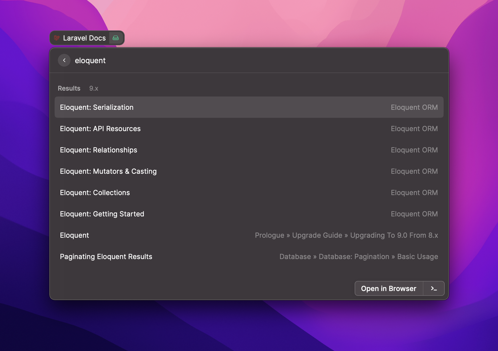

# Laravel Docs Search for Raycast

To install this [Raycast](https://www.raycast.com) custom script, follow these steps:

1. Clone this repo: `git clone https://github.com/simonellensohn/raycast-laravel-docs.git`
2. Open the Raycast prompt, type "Extensions," and press enter.
3. Click the plus button in the menu bar.
4. Click `Add Script Directory`.
5. Browse to where you cloned the `raycast-laravel-docs` folder and select it.
6. You're done. Re-open the Raycast command prompt and type, "Laravel" You should see the new "Laravel Docs" script pop up.

## Change Docs Version

To change the Laravel Docs Version, follow these steps:

1. Open the Raycast prompt, type "Extensions", and press enter.
2. Search for the "Laravel Docs" extension name.
3. Select a version from the Extension Settings.
